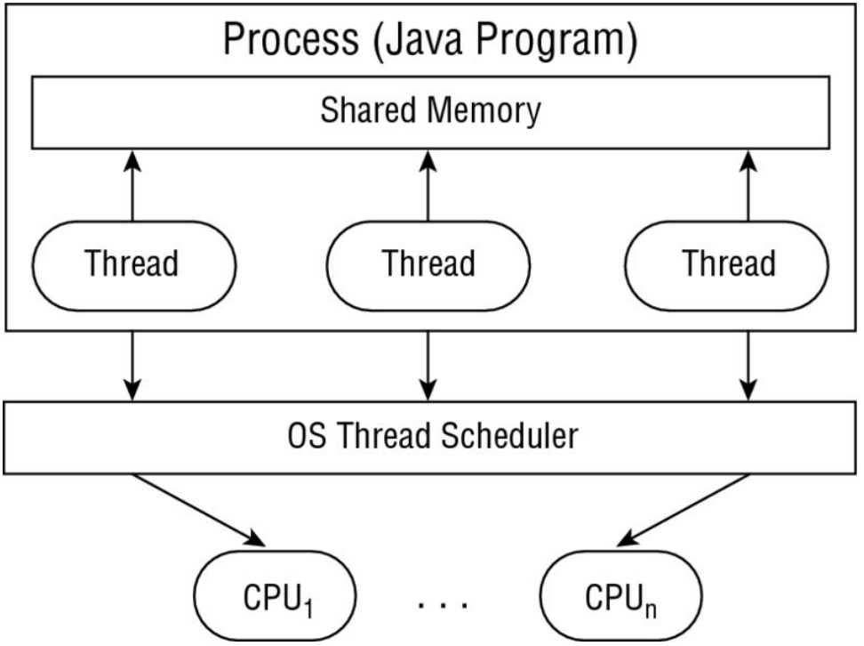

#Thread 
is the smallest unit of execution that can be scheduled by the operating system.

#Process 
is a group of associated threads that execute in the same, shared environment

#Shared environment 
we mean that the threads in the same process share the same memory space and can communicate directly with one another.

#Task 
is a single unit of work performed by a thread.

A thread can complete multiple independent tasks but only one task at a time.

Operating systems use a thread scheduler to determine which threads should be currently executing

#Context Switch 
is the process of storing a thread’s current state and later restoring the state of the thread to continue execution.

#Thread Priority 
is a numeric value associated with a thread that is taken into consideration by the thread scheduler when determining which threads should currently be executing

#VALID lambda expressions (Runnable interface):

() -> System.out.println("Hello World")
() -> {int i=10; i++;}
() -> {return;}
() -> {}

#INVALID lambda expressions (they return value)

() -> ""
() -> 5
() -> {return new Object();}

#Liveness problems are those in which the application becomes unresponsive or in some kind of “stuck” state

#Deadlock 
occurs when two or more threads are blocked forever, each waiting on the other

#Starvation 
occurs when a single thread is perpetually denied access to a shared resource or lock. The thread is still active, 
but it is unable to complete its work as a result of other threads constantly taking the resource that they 
trying to access.

#Livelock 
occurs when two or more threads are conceptually blocked forever, although they are each still active and trying 
to complete their task. Livelock is a special case of resource starvation in which two or more threads actively 
try to acquire a set of locks, are unable to do so, and restart part of the process.

